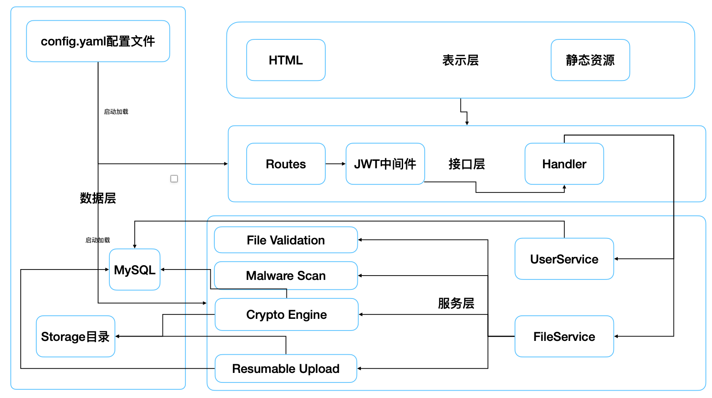

# 安全文件盒
[**English**](README.md)

一个基于 Go + Gin 的 Web 应用，用于用户认证与加密文件存储，前端为静态 HTML/CSS/JS。
<p align="center">
  
</p>

**主要功能**
- 使用 JWT 的用户注册/登录（含资料、头像、密码修改）
- 加密文件上传/下载（AES-256-GCM，分块）
- 批量上传 + 断点续传
- 文件预览（图片/文本/PDF/Office）
- 文件类型校验 + 可选的恶意软件扫描
- 由后端提供的静态 Web UI

---

## 1. 项目布局
<p align="center">
  
</p>

- `cmd/server/main.go`：应用入口
- `internal/config/`：配置加载与校验
- `internal/handler/`：Gin HTTP 处理器
- `internal/service/`：业务逻辑（文件加密在此处）
- `internal/model/`：GORM 模型
- `internal/pkg/`：数据库、日志、辅助工具
- `internal/routes/`：API + 静态路由
- `web/templates/`：HTML 页面
- `web/static/`：JS/CSS/图片
- `storage/`：加密文件存储（运行时创建）
- `config.yaml`：运行时配置

---

## 2. 依赖环境

- Go 1.18+（建议与 `go.mod` 版本匹配）
- MySQL 8+（或兼容版本）
- 可选：ClamAV（`clamscan` 或 `clamdscan`）用于恶意软件扫描
- 可选：LibreOffice（`libreoffice` 或 `soffice`）用于 Office 预览

---

## 3. 配置（`config.yaml`）

最少需要配置以下字段：

- `database.*`：数据库连接参数
- `jwt.secret`：JWT 签名密钥（至少 32 个字符）
- `jwt.expiry_minutes`：令牌有效期（分钟）
- `file_crypto.key`：**base64 URL 安全**密钥（解码后至少 32 字节）
- `malware_scan.*`：可选的恶意软件扫描配置

示例（仓库内已包含）：

```yaml
server:
  app_name: secure_file_box
  env: development
  debug: true
  host: 127.0.0.1
  port: 8080
  time_zone: Asia/Shanghai

database:
  driver: mysql
  host: localhost
  port: 3306
  user: root
  password: "0827"
  name: secure_file_box

jwt:
  issuer: secure_file_box
  audience: secure_users
  expiry_minutes: 60
  secret: <your-strong-secret>

file_crypto:
  key: <base64-url-encoded-32-bytes>

malware_scan:
  enabled: true
  command: ""          # empty = auto-detect clamscan/clamdscan
  timeout_seconds: 30
  allow_on_failure: false
```

说明：
- 启动时，如果 `jwt.secret` 或 `file_crypto.key` 缺失或强度不足，应用会**自动**生成并写回 `config.yaml`。
- `file_crypto.key` 必须是 Base64 URL-safe 格式（无填充）。示例生成方式：
- 配置也可以通过环境变量覆盖，例如 `JWT_SECRET` 和 `FILE_CRYPTO_KEY`。

```bash
python - <<'PY'
import os, base64
print(base64.urlsafe_b64encode(os.urandom(32)).rstrip(b'=').decode())
PY
```

---

## 4. 数据库设置

创建数据库（数据库名必须与 `config.yaml` 保持一致）：

```sql
CREATE DATABASE secure_file_box;
```

设置 MySQL root 密码，使其与 `config.yaml` 中的配置一致（示例）：

```sql
ALTER USER 'root'@'localhost' IDENTIFIED BY 'yourpassword';
```

---

## 5. 运行（开发）

在仓库根目录执行：

```bash
go run cmd/server/main.go
```

打开：

- `http://127.0.0.1:8080`

---

## 6. 构建（生产）

- 构建
```bash
go build -o bin/efb_backend cmd/server/main.go
```

- 运行
```bash
bin/efb_backend
```

---

## 7. API 概览

所有 API 都挂载在 `/api/v1` 下。

- `GET /api/v1/ping`
- `POST /api/v1/auth/register`
- `POST /api/v1/auth/login`
- `POST /api/v1/auth/logout`
- `GET /api/v1/user/profile`
- `PUT /api/v1/user/profile`
- `GET /api/v1/user/avatar`
- `PUT /api/v1/user/avatar`
- `PUT /api/v1/user/password`

文件接口：
- `POST /api/v1/files/upload`（需要 JWT）
- `POST /api/v1/files/batch`（需要 JWT）
- `POST /api/v1/files/public/upload`（无需 JWT）
- `GET /api/v1/files`（需要 JWT）
- `GET /api/v1/files/download/:id`（需要 JWT）
- `GET /api/v1/files/preview/:id`（需要 JWT）
- `PUT /api/v1/files/:id`（需要 JWT）
- `DELETE /api/v1/files/:id`（需要 JWT）
- `DELETE /api/v1/files/batch`（需要 JWT）
- `POST /api/v1/files/resumable/init`（需要 JWT）
- `GET /api/v1/files/resumable/:upload_id`（需要 JWT）
- `POST /api/v1/files/resumable/:upload_id/chunk`（需要 JWT）
- `POST /api/v1/files/resumable/:upload_id/complete`（需要 JWT）
- `DELETE /api/v1/files/resumable/:upload_id`（需要 JWT）

同时也保留了不带 `/api/v1` 前缀的旧路由，用于兼容旧客户端。

---

## 8. 上传与校验

- 允许的扩展名：`jpg`, `jpeg`, `png`, `gif`, `webp`, `txt`, `md`, `json`, `log`, `csv`, `pdf`, `doc`, `docx`, `xls`, `xlsx`, `ppt`, `pptx`。
- 禁止的扩展名：`exe`, `dll`, `so`, `bin`, `sh`, `bat`, `apk`, `dmg`, `iso`, `msi`, `com`, `scr`。
- 内容校验会检查 MIME 类型和文件头；文本文件必须是 UTF-8。
- 断点续传会将 `chunk_size` 限制在 256 KB 到 20 MB 之间。
- 恶意软件扫描由 `malware_scan.*` 控制，并使用 ClamAV。若启用扫描但没有可用扫描器，除非设置 `allow_on_failure: true`，否则上传会失败。

---

## 9. 预览

- `/files/preview/:id` 支持图片、文本、PDF 与 Office 文件预览。
- 文本预览最多 2 MB，并会按 UTF-8/UTF-16/GB18030/ISO-8859-1 进行解码尝试。
- Office 预览需要 LibreOffice（`libreoffice` 或 `soffice`）在运行时转换为 PDF。

---

## 10. 加密详情

文件内容和元数据都使用 AES-256-GCM 进行保护，密钥从 `file_crypto.key` 派生。

**密钥策略**
- `file_crypto.key` 必须是 Base64 URL-safe（无填充）格式，且解码后至少 32 字节。
- 使用同一主密钥通过 HMAC-SHA256 派生两把子密钥：
- 文件内容密钥：`HMAC(key, "file-gcm-aes256")`
- 元数据密钥：`HMAC(key, "db-meta-gcm-aes256")`

**文件加密（分块）**
- 算法：AES-256-GCM。
- 分块大小：32 KB。
- 文件头：魔数 `SFB2` + 8 字节随机 nonce 前缀。
- 每个分块 nonce：`prefix(8)` + `counter(4)`（大端递增）。
- AAD：4 字节计数器（大端）。
- 分块存储格式：`uint32(len(sealed))`（大端） + `sealed`（密文 + GCM tag）。
- 解密时会逐块认证，任意失败都会返回 `file integrity check failed`。

**元数据加密（数据库字段）**
- 字段：文件名、存储路径、大小、描述、上传者 ID、MIME。
- 每个字段都独立加密，使用随机 12 字节 nonce。
- 存储格式：`v1:` + Base64 URL-safe（无填充）编码的 `nonce || sealed`。
- 解密失败会返回 `metadata integrity check failed`；列表接口会跳过这类记录，以避免整个响应失败。

**兼容与迁移**
- 如果 `enc_*` 字段为空，服务会回退读取旧字段（`legacy_*`）。

**重要说明**
- 更改 `file_crypto.key` 会导致现有文件和元数据无法解密。
- 如果看到 `invalid file magic` 或 `invalid encrypted metadata format`，通常意味着密钥不匹配、格式变更或数据损坏。

---

## 11. 测试

测试位于 `test/` 目录，使用临时 SQLite 数据库（不需要 MySQL）。测试中默认关闭恶意软件扫描，Office 预览转换未覆盖。

运行全部测试：

```bash
go test ./...
```

仅运行测试包：

```bash
go test ./test -v
```

覆盖点：
- `test/config_test.go`：密钥生成与配置写回。
- `test/file_validation_test.go`：扩展名允许/阻止与内容校验。
- `test/file_service_test.go`：加密/解密流程、限制、旧字段回退。
- `test/resumable_upload_test.go`：初始化/分块/完成流程与错误场景。
- `test/user_service_test.go`：用户创建/认证/密码/资料流程。
- `test/jwt_middleware_test.go`：JWT 中间件正常与未授权路径。
- `test/utils_test.go`：密码哈希与分页默认值。

说明：
- 文件加密使用 `test/test_helpers.go` 中的固定测试密钥。
- 临时文件和 sqlite 数据库都会创建在 `t.TempDir()` 下，并自动清理。

---

## 12. 故障排除

- **MySQL 身份验证错误**：检查 `database.user/password` 是否正确，以及数据库是否可访问。
- **文件魔数无效/完整性检查失败**：文件使用了不同的 `file_crypto.key` 加密、采用旧格式，或已损坏。
- **启动时密钥错误**：确保 `file_crypto.key` 是有效的 Base64 URL-safe 密钥，且解码后至少 32 字节。
- **预览不可用**：安装 LibreOffice（`libreoffice`/`soffice`）。
- **恶意软件扫描失败**：检查 `malware_scan.command` 或安装 ClamAV。

---

## 13. 部署说明

- 生产环境建议使用环境变量或密钥管理器。
- 在 Go 服务前面放置 Nginx/Traefik 以启用 TLS。
- `storage/` 和数据库要一起备份。

---

## 14. 贡献

在进行较大更改前请先提交 issue。保持改动尽量小，并尽可能附带测试。
